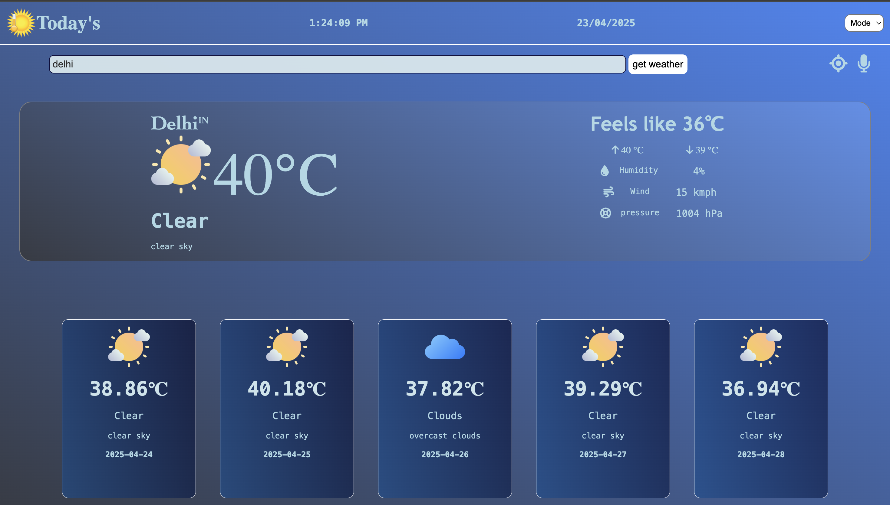
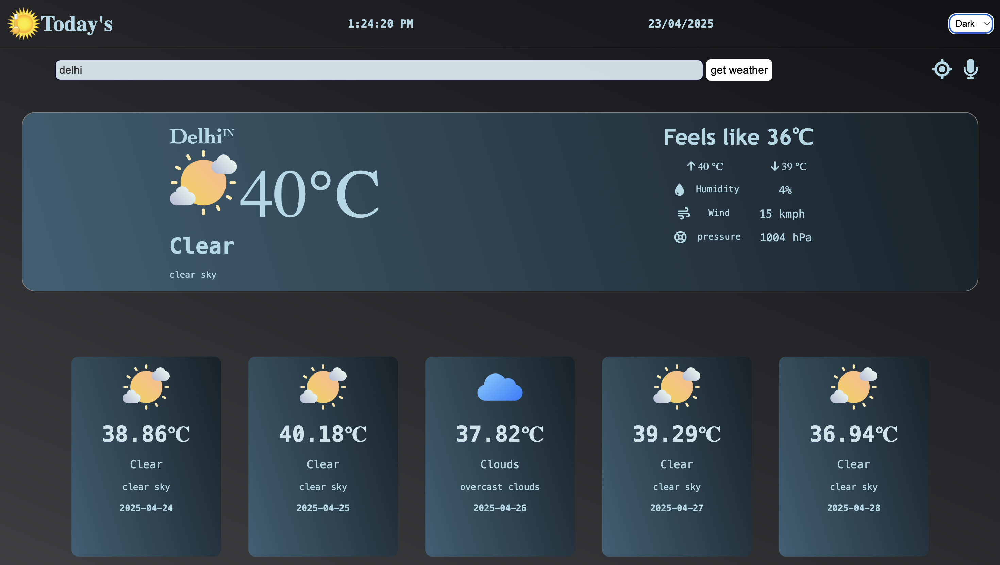
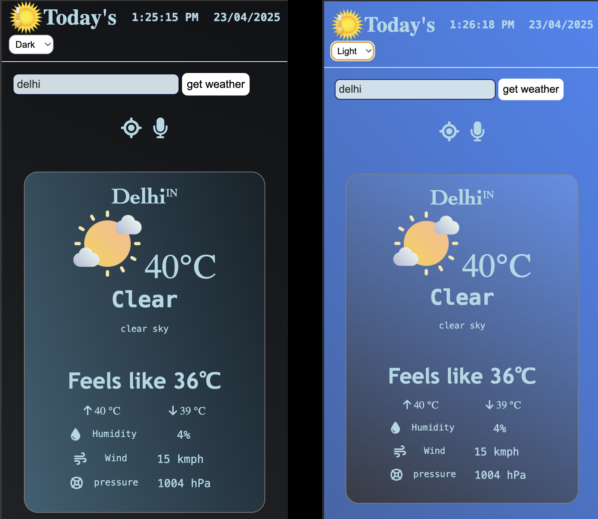

# Weather Application ⛈️

# <span style = "color:skyblue;"> Description </span>

<span style="color: skyblue; font-style: italic;">
  This project provides weather updates for locations around the world. You can check the current weather and a 5-day forecast for any city or country. Stay informed with daily temperature details and plan your travels with confidence. Before heading out, check the weather in advance and be prepared!
</span>

# Have a Look of project [👉 Link](https://vandanafuloria.github.io/weather-update/)

## Images







# Installation

1. Clone this repository

```
git clone https://github.com/vandanafuloria/weather-update.git
```

2. To install all the dependecies

```
 npm install
```

3. Build the project

```
npm run build
```

4. Dev Server start on `http://localhost:8080`

```
npm run start
```

# Bundler : Webpack configuration

```
npm install --save-dev webpack webpack-cli html-loader style-loader css-loader file-loader
```

- html loader
- style loader
- css loader
- file loader

# Api Used

Method `GET`, `opneweathermap.org`

1. `Current weather data api`

```
https://api.openweathermap.org/data/2.5/weather?q=${city}&appid${key}
```

2. `5 Day / 3 Hour Forecast`

```
https://api.openweathermap.org/data/2.5/forecast?q=${city}&appid${key}
```

## Contribution

1. Fork this repo.
2. Create your branch (`git checkout -b feature-branch`)
3. Commit your changes (`git commit -am 'Add new feature'`)
4. Push to the branch (`git push origin feature-branch`)
5. Open a pull request.

## Contact

Feel free to reach out to me via [email](vandanafuloria02@gmail.com) if you encounter any issue.
